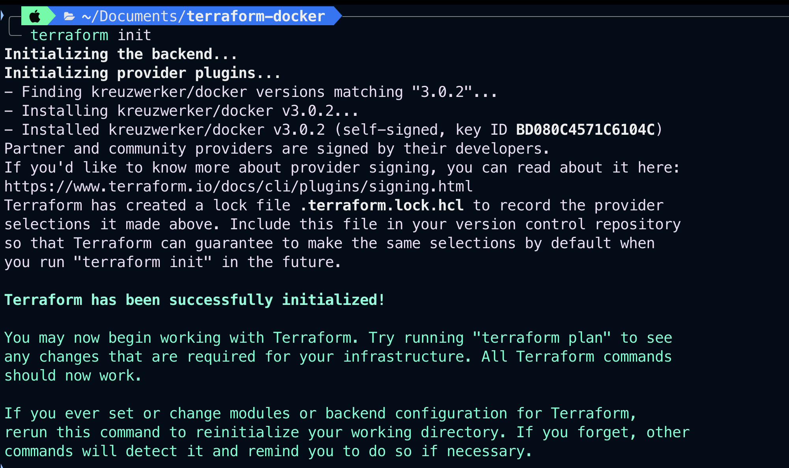
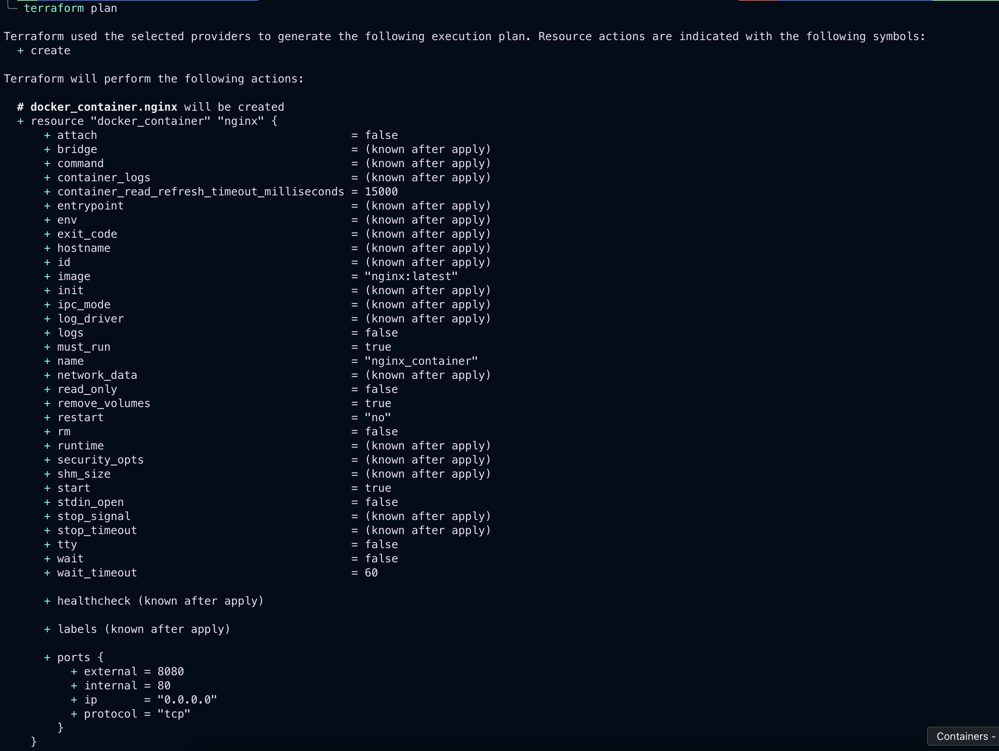
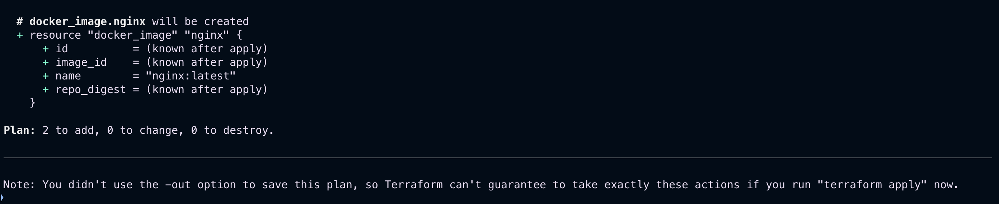
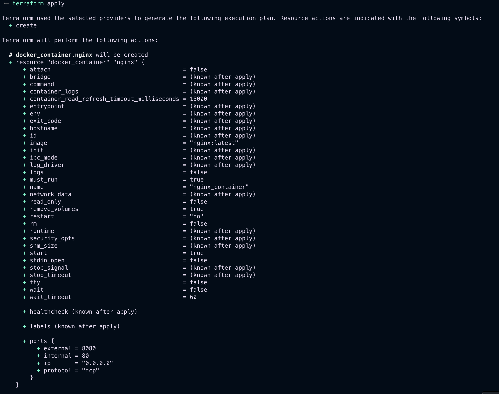
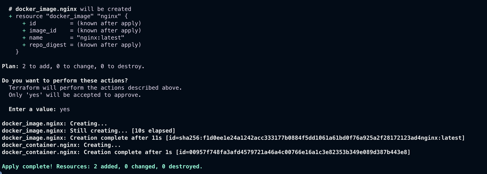
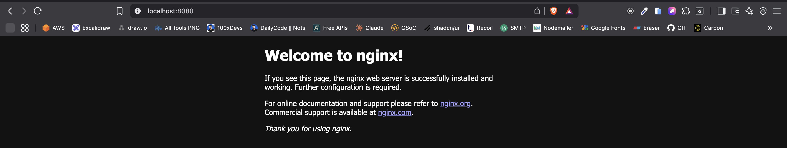
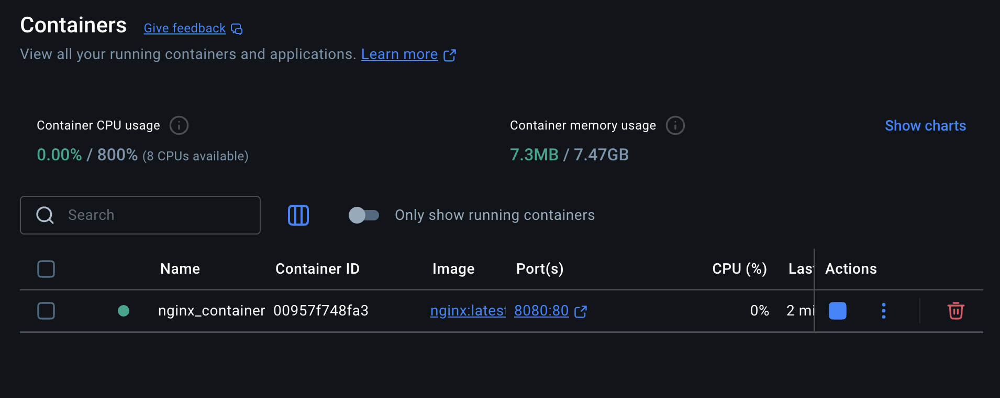
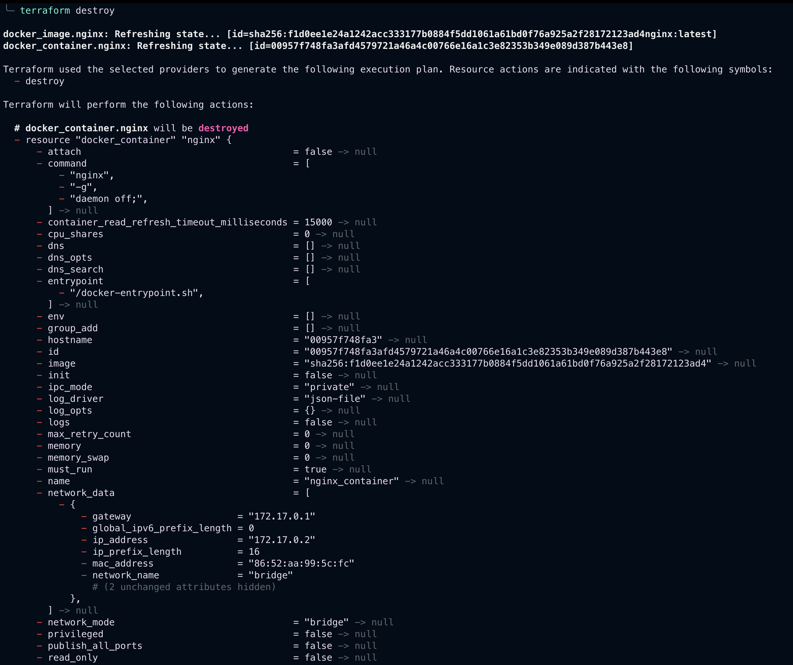
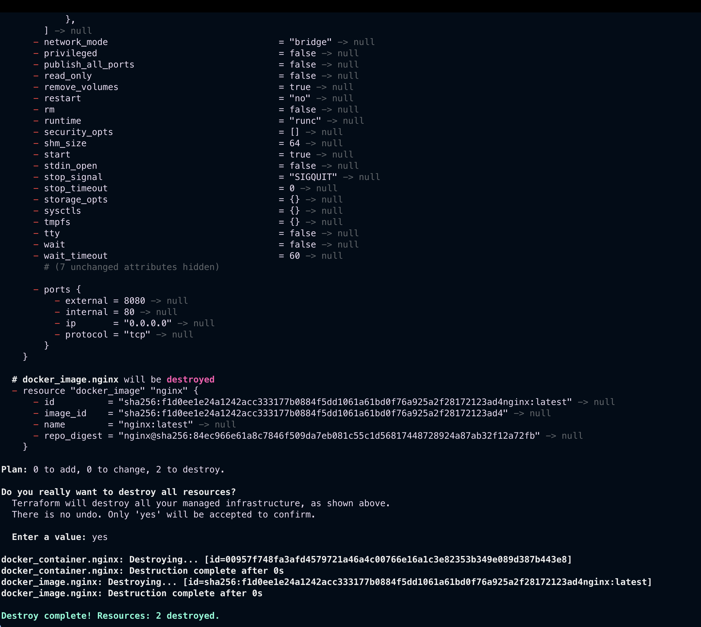

# 🚀 Terraform NGINX Docker Project

This project demonstrates how to use Terraform to pull the official NGINX Docker image and run it as a container locally using the `terraform-provider-docker`.

---

## 🧰 Prerequisites

- [Docker](https://www.docker.com/)
- [Terraform](https://developer.hashicorp.com/terraform/downloads)

---

## ⚙️ Terraform Commands

### Initialize the Terraform configuration

```bash
terraform init
```


###  Preview the execution plan
```bash
terraform plan
```



###  Apply the configuration
```bash
terraform apply -auto-approve
```



🟢 NGINX should now be running at: *http://localhost:8080*



### Destroy the infrastructure
```bash
terraform destroy -auto-approve
```


